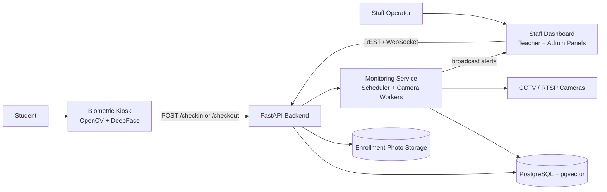
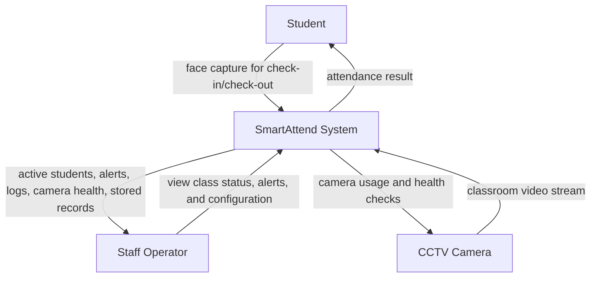
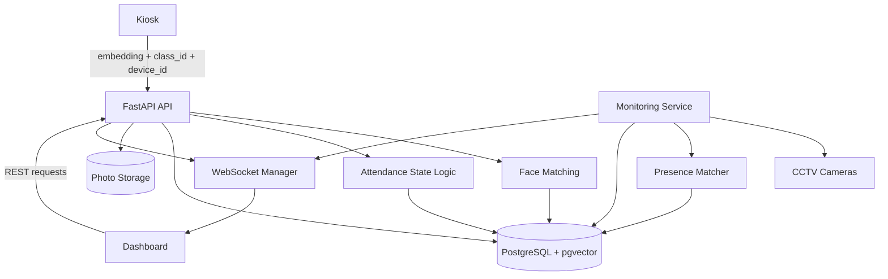
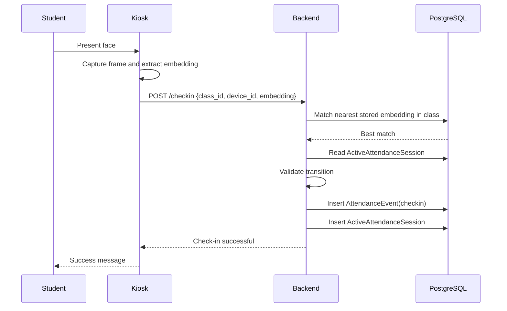
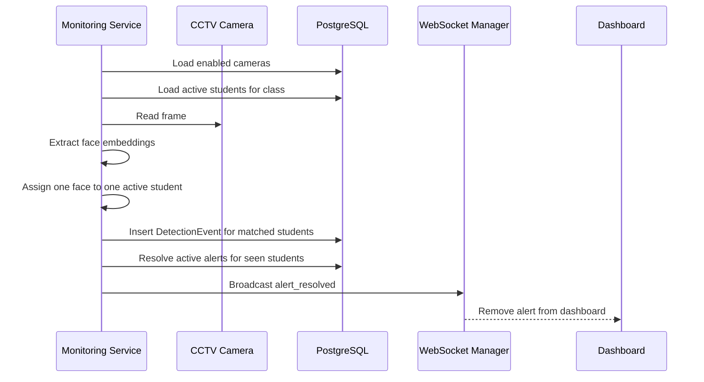
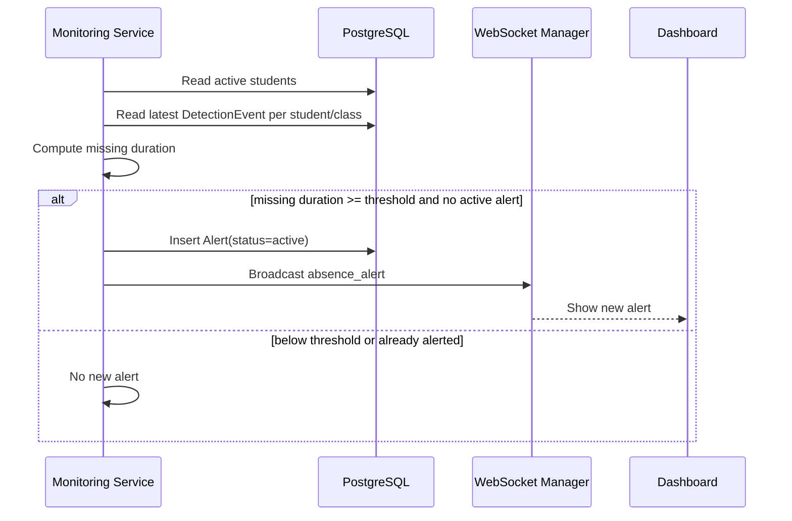
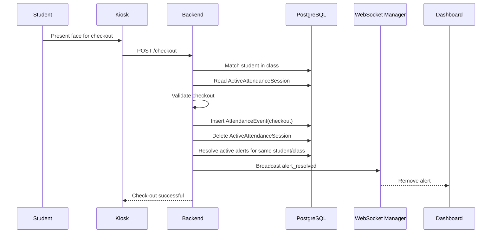
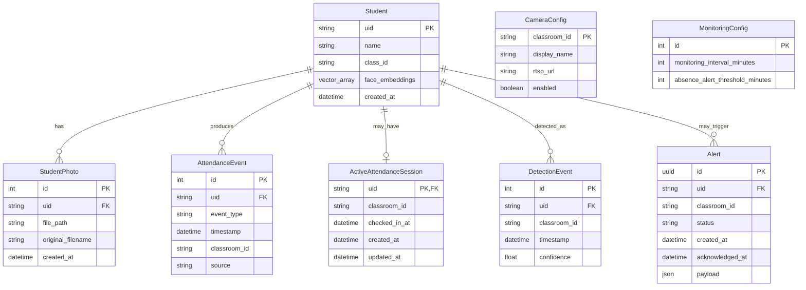

# SmartAttend System Documentation

## 1. Document Purpose

This document describes the implemented SmartAttend system in the current codebase. It covers:

- business purpose
- actors and access levels
- system architecture
- data flow diagrams
- end-to-end flows
- data model
- backend API surface
- runtime behavior
- configuration
- deployment and local run model
- current limitations and next improvements

This document reflects the implementation in:

- `kiosk/`
- `server/`
- `dashboard/`

## 2. System Summary

SmartAttend is a classroom attendance and presence-monitoring system.

Core idea:

1. A student checks in through the biometric kiosk.
2. The backend marks that student as actively checked in for a class.
3. The CCTV monitoring service watches only students who are actively checked in.
4. If a checked-in student is not seen by the classroom camera for the configured threshold, the system raises an absence alert.
5. When the student checks out, the backend removes the student from active tracking and clears any active alert for that student in that class.

SmartAttend is not just an attendance register. It combines:

- biometric check-in and check-out
- class-scoped face matching
- CCTV-based in-room presence tracking
- dashboard alerts for missing checked-in students
- student, camera, and monitoring management tools

## 3. Business Rules

- `class_id` is the main academic grouping key used across kiosk, backend, dashboard, alerts, and camera configuration.
- A student can have only one active attendance session at a time.
- A check-in is idempotent for the same class.
- A checkout is only valid if the student is currently checked in to that same class.
- CCTV monitoring only evaluates students in `active_attendance_sessions`.
- Absence is measured from:
  - last CCTV detection if the student has been seen before
  - otherwise the check-in time
- If the camera was unhealthy and later recovers, absence timing restarts from the camera recovery point instead of counting missing time during the outage.
- Alerts are class-scoped and student-scoped.
- A checkout resolves active alerts for that student and class.
- A fresh CCTV detection also resolves active alerts for that student and class.

## 4. Actors and Access Levels

### Student

- interacts with the kiosk camera
- triggers check-in or check-out

### Staff Operator

- uses the single dashboard application
- monitors active students and alerts for a selected class
- can also manage students, cameras, and monitoring settings if given higher access

### Backend Access Levels

#### Teacher-level access

- read active students, attendance sessions, and alerts
- acknowledge or dismiss alerts
- connect to the alert websocket

#### Admin-level access

- register students with enrollment photos
- configure class cameras
- change monitoring interval and absence threshold
- view camera health

Implementation note:

- in the current product, teacher and admin are better understood as backend permission levels
- the dashboard UI combines both teacher-facing and admin-facing functions in one operator screen
- admin-level access is effectively a superset of teacher-level access

## 5. High-Level Architecture

## 6. Component Architecture

### 6.1 Kiosk

Responsibilities:

- reads local camera frames with OpenCV
- extracts one facial embedding from the current frame using DeepFace
- posts check-in or check-out requests to the backend
- displays immediate success or error feedback on screen

Important implementation details:

- configuration lives in `kiosk/.env`
- `SMARTATTEND_API_URL=auto` makes the kiosk infer backend URL from `server/.env`
- default camera index is `1`
- default action is `checkin`
- supported actions are only `checkin` and `checkout`
- capture hotkeys:
  - `c` = capture and submit
  - `q` = quit

### 6.2 Backend API

Responsibilities:

- serves REST endpoints for attendance, alerts, admin functions, and camera status
- serves REST endpoints for attendance, alerts, management functions, and camera status
- stores students, events, sessions, detections, alerts, and configuration
- performs face matching for kiosk requests
- rebuilds active attendance state on startup
- hosts the monitoring service
- broadcasts alert events over WebSocket

### 6.3 Monitoring Service

Responsibilities:

- keeps persistent per-camera workers for enabled class cameras
- samples frames at a configured interval
- extracts all visible face embeddings from the frame
- matches those faces only against currently active students in that class
- records detection events
- resolves alerts when a student is seen again
- raises alerts when a checked-in student remains unseen beyond threshold
- tracks camera health and exposes it to the staff dashboard

### 6.4 Dashboard

Responsibilities:

- combines teacher-facing monitoring with admin-facing management in one UI
- shows active students and live alerts for a selected class
- supports student registration, camera configuration, monitoring settings, and camera health
- periodic polling for state refresh
- WebSocket subscription for live alert creation and resolution

Important implementation details:

- teacher-facing data polling every 15 seconds
- admin-facing data polling every 30 seconds
- alert websocket heartbeat every 10 seconds
- selected class view is determined by `VITE_CLASS_ID` or user input

### 6.5 PostgreSQL + pgvector

Responsibilities:

- stores canonical operational state
- stores student face embeddings in pgvector-compatible arrays
- stores event history and current active state

### 6.6 Enrollment Photo Storage

Responsibilities:

- stores original student registration photos on disk
- keeps backend-serving path constrained under configured storage root

Default path:

- `server/storage/enrollment_photos/`

## 7. Directory and Module Map

### 7.1 Kiosk

- `kiosk/main.py`
  - kiosk runtime
  - env loading
  - backend URL inference
  - local camera handling
  - face extraction
  - request submission

### 7.2 Backend

- `server/app/main.py`
  - API routes
  - startup and shutdown lifecycle
  - monitoring service integration
- `server/app/config.py`
  - environment configuration
- `server/app/models.py`
  - ORM models
- `server/app/auth.py`
  - optional token-based access control
- `server/app/monitoring.py`
  - scheduler, camera workers, alert generation, detection recording
- `server/app/face.py`
  - embedding extraction from images and uploaded files
- `server/app/storage.py`
  - enrollment photo persistence and path safety
- `server/app/ws.py`
  - alert websocket connection manager
- `server/app/services/attendance.py`
  - attendance state rules and reporting helpers
- `server/app/services/matching.py`
  - kiosk check-in and check-out face matching
- `server/app/services/presence.py`
  - vectorized CCTV face-to-student assignment

### 7.3 Dashboard

- `dashboard/src/App.jsx`
  - orchestration, polling, websocket setup, form submission
- `dashboard/src/api.js`
  - API helpers, auth header injection, websocket URL construction
- `dashboard/src/components/TeacherDashboard.jsx`
  - teacher-facing monitoring area for active students and alerts
- `dashboard/src/components/AdminPanel.jsx`
  - admin-facing management area for students, cameras, settings, and camera health

## 8. External Dependencies

- FastAPI
- SQLAlchemy async
- asyncpg
- PostgreSQL
- pgvector
- DeepFace
- OpenCV
- NumPy
- APScheduler
- React
- Vite
- Tailwind CSS
- Docker Compose for local PostgreSQL startup

## 9. Data Flow Diagrams

### 9.1 DFD Level 0: System Context

### 9.2 DFD Level 1: Internal Data Movement

### 9.3 DFD Level 2: Attendance and Presence Monitoring

```mermaid
flowchart LR
    A[Kiosk Capture] --> B[Extract Embedding]
    B --> C[POST /checkin or /checkout]
    C --> D[Match Student by Class]
    D --> E[Validate Attendance Transition]
    E --> F[Write Attendance Event]
    F --> G[Update ActiveAttendanceSession]
    G --> H[Student becomes active for CCTV tracking]

    H --> I[Camera Worker Samples Frame]
    I --> J[Extract All Face Embeddings]
    J --> K[Assign Faces to Active Students]
    K --> L[Write DetectionEvent]
    L --> M[Resolve Existing Alert if Student Seen]
    H --> N[Periodic Alert Evaluation]
    N --> O[Compare Checked-in Students vs Last Seen Times]
    O --> P[Create Alert if Missing >= Threshold]
    P --> Q[Broadcast Alert to Dashboard]
```

## 10. Sequence Diagrams

### 10.1 Student Check-In Flow

### 10.2 CCTV Detection Flow

### 10.3 Absence Alert Flow

### 10.4 Checkout Flow

## 11. Core Functional Flows

### 11.1 Student Registration Flow

1. Staff operator opens dashboard with admin-level access.
2. The operator submits `uid`, `name`, `class_id`, and at least 5 photos.
3. Backend reads all uploaded bytes.
4. Backend tries to extract face embeddings from each photo.
5. At least `MIN_REGISTRATION_EMBEDDINGS` valid embeddings are required.
6. Backend stores:
   - `Student`
   - `StudentPhoto`
   - original photo files on disk
7. Student becomes available for kiosk matching and CCTV monitoring.

### 11.2 Check-In Flow

1. Kiosk captures a frame.
2. Kiosk extracts one normalized embedding.
3. Kiosk sends `class_id`, `device_id`, and the embedding to `/checkin`.
4. Backend searches the nearest embedding only within that class if `class_id` is provided.
5. Backend validates attendance transition using `ActiveAttendanceSession`.
6. Backend writes:
   - one `AttendanceEvent` with `event_type = checkin`
   - one `ActiveAttendanceSession`
7. Student now appears in active student queries and becomes eligible for CCTV monitoring.

### 11.3 Monitoring Flow

1. On backend startup, `MonitoringService.start()` is called.
2. The scheduler runs `run_cycle()` every minute.
3. `run_cycle()` syncs enabled camera workers from `camera_configs`.
4. Each enabled camera runs as a persistent worker task.
5. Each worker:
   - keeps the RTSP connection open when possible
   - reconnects with exponential backoff on failure
   - samples frames using `CAMERA_SAMPLE_INTERVAL_SECONDS`
6. For each valid frame:
   - backend loads active students for that class
   - backend extracts all visible face embeddings from the frame
   - backend assigns faces to students using vectorized matching
   - backend stores `DetectionEvent` for each successful student match
   - backend resolves active alerts for students seen again

### 11.4 Absence Alert Flow

1. Monitoring cycle loads current monitoring settings.
2. Backend gathers active students from `active_attendance_sessions`.
3. Backend gathers the latest `DetectionEvent` per student and class.
4. For each active student, absence duration is computed from:
   - `last_seen_at`
   - or `checked_in_at` if never seen
   - but not before `healthy_since` if camera recently recovered
5. If duration reaches `ABSENCE_ALERT_THRESHOLD_MINUTES` and there is no active alert already:
   - create `Alert(status = active)`
   - broadcast `absence_alert` on websocket
6. The dashboard adds the alert in real time.

### 11.5 Alert Resolution Flow

An alert is resolved if any of the following happens:

- the student is seen again by CCTV
- the student checks out
- the student is no longer in the active student set for that class

When resolved:

- `Alert.status` becomes `resolved`
- `acknowledged_at` is filled with resolution time
- websocket broadcast removes the alert from connected dashboards

### 11.6 Staff Alert Handling Flow

1. Staff operator sees an active alert.
2. The operator clicks `Acknowledge` or `Dismiss`.
3. Backend updates alert status.
4. Backend broadcasts `alert_resolved`.
5. All connected dashboards remove the alert.

### 11.7 Startup Recovery Flow

1. Backend starts.
2. Database tables are created if missing.
3. Backend rebuilds `active_attendance_sessions` from latest attendance events.
4. Monitoring service starts.
5. Camera worker set is synchronized from enabled camera configs.

This protects the system from losing current checked-in state after backend restart.

## 12. Data Model

### 12.1 Entity Relationship Overview

### 12.2 Table Meanings

#### `students`

- canonical student identity
- stores name, class, and facial embeddings

#### `student_photos`

- stores metadata for original enrollment images
- actual files live on disk

#### `attendance_events`

- immutable event log of check-in and check-out actions

#### `active_attendance_sessions`

- current operational state of who is checked in right now
- primary source for active student tracking

#### `detection_events`

- CCTV sightings of active students

#### `alerts`

- absence alerts and their status transitions

#### `camera_configs`

- per-class camera configuration

#### `monitoring_config`

- global monitoring interval and absence threshold

## 13. API Reference

### 13.1 Public Endpoint

#### `GET /health`

Purpose:

- basic API health status

Response:

- `api_status`
- `auth_enabled`

### 13.2 Kiosk Attendance Endpoints

#### `POST /checkin`

Input:

- `class_id`
- `embedding`
- `device_id`

Behavior:

- matches the student
- validates transition
- writes check-in event
- creates active session

#### `POST /checkout`

Input:

- `class_id`
- `embedding`
- `device_id`

Behavior:

- matches the student
- validates transition
- writes checkout event
- deletes active session
- resolves alerts

### 13.3 Teacher-Level Endpoints

These are protected by teacher-level access if auth is enabled. Admin-level access also works for these endpoints.

#### `GET /system/status`

- authenticated system health

#### `GET /active-students`

Query:

- `class_id` or `classroom_id`

Returns:

- currently active students
- check-in time
- last seen time

#### `GET /attendance-sessions`

Query:

- `class_id` or `classroom_id`
- `limit`

Returns:

- recent attendance sessions reconstructed from event history

#### `GET /alerts`

Query:

- `class_id` or `classroom_id`

Returns:

- active alerts

#### `POST /alerts/{alert_id}/acknowledge`

- marks alert as acknowledged

#### `POST /alerts/{alert_id}/dismiss`

- marks alert as dismissed

### 13.4 Admin-Level Endpoints

These require admin-level access if auth is enabled.

#### `POST /admin/students`

- registers student and uploads enrollment photos

#### `GET /admin/students`

- lists students and available photo URLs

#### `GET /admin/students/{uid}/photos/{photo_id}`

- returns protected student photo file

#### `POST /admin/cameras`

- creates or updates camera configuration for a class

#### `GET /admin/cameras`

- lists saved cameras with masked RTSP URLs

#### `GET /admin/camera-status`

- runtime status for each camera

#### `GET /admin/settings`

- current monitoring interval and absence threshold

#### `PUT /admin/settings`

- updates monitoring settings

### 13.5 WebSocket Endpoint

#### `WS /ws/alerts/{class_id}`

Purpose:

- live dashboard alert feed

Events:

- `absence_alert`
- `alert_resolved`

## 14. Authentication and Authorization

Authentication is optional.

The current product behaves like one staff dashboard, but the backend still distinguishes between teacher-level and admin-level permissions.

If `TEACHER_TOKEN` and `ADMIN_TOKEN` are both empty:

- backend auth is effectively disabled

If configured:

- teacher-level endpoints accept teacher token or admin token
- admin-level endpoints accept admin token only
- websocket accepts teacher token or admin token

Supported token delivery:

- header: `x-smartattend-token`
- query parameter: `token`

## 15. Matching and Recognition Logic

### 15.1 Kiosk Matching

Used for:

- check-in
- check-out

Method:

- query all stored embeddings for students in the requested class
- compute nearest vector distance using pgvector
- convert distance to confidence
- reject if distance exceeds `FACE_DISTANCE_THRESHOLD`

### 15.2 CCTV Presence Matching

Used for:

- in-class presence verification

Method:

- only active students for the class are considered
- all visible faces in the frame are embedded
- the system builds vectorized similarity matrices with NumPy
- greedy assignment ensures:
  - one student maps to at most one face
  - one face maps to at most one student

This prevents one detected face from incorrectly satisfying multiple students in the same frame.

## 16. Camera Health and Monitoring Status

Per-camera status can be:

- `pending`
- `online`
- `idle`
- `error`
- `disabled`

Meaning:

- `pending`: camera known but no healthy frame yet
- `online`: frames are being processed and active students exist
- `idle`: camera is healthy but there are no active students to track
- `error`: connection or frame capture failed
- `disabled`: camera is configured but not enabled

Health fields:

- `last_checked_at`
- `last_success_at`
- `last_error`
- `healthy_since`

Important reliability rule:

- alerts are only raised for classes whose camera has a healthy monitoring window

## 17. Polling and Real-Time Update Model

### Dashboard polling

- teacher-facing panel refresh: every 15 seconds
- admin-facing panel refresh: every 30 seconds

### WebSocket push

- alerts are pushed instantly
- alert removals are pushed instantly
- dashboard keeps a simple heartbeat every 10 seconds

## 18. Configuration Reference

### 18.1 Backend Configuration

Key variables from `server/.env`:

- `DATABASE_URL`
- `SERVER_HOST`
- `SERVER_PORT`
- `CORS_ORIGINS`
- `EMBEDDING_DIM`
- `FACE_MODEL_NAME`
- `DETECTOR_BACKENDS`
- `FACE_DISTANCE_THRESHOLD`
- `MONITORING_INTERVAL_MINUTES`
- `ABSENCE_ALERT_THRESHOLD_MINUTES`
- `CAMERA_SAMPLE_INTERVAL_SECONDS`
- `CAMERA_RECONNECT_MAX_DELAY_SECONDS`
- `MIN_REGISTRATION_EMBEDDINGS`
- `ENROLLMENT_PHOTO_DIR`
- `TEACHER_TOKEN`
- `ADMIN_TOKEN`

### 18.2 Dashboard Configuration

Key variables from `dashboard/.env`:

- `VITE_API_BASE`
- `VITE_CLASS_ID`
- `VITE_TEACHER_TOKEN`
- `VITE_ADMIN_TOKEN`
- `VITE_PROXY_TARGET`
- `VITE_WS_PROXY_TARGET`

### 18.3 Kiosk Configuration

Key variables from `kiosk/.env`:

- `SMARTATTEND_API_URL`
- `SMARTATTEND_CLASS_ID`
- `SMARTATTEND_DEVICE_ID`
- `SMARTATTEND_CAMERA_SOURCE`
- `SMARTATTEND_CAMERA_INDEX`
- `SMARTATTEND_CAMERA_BACKEND`
- `SMARTATTEND_ACTION`
- `SMARTATTEND_FACE_MODEL`
- `SMARTATTEND_EMBEDDING_DIM`

## 19. Local Runtime and Deployment Model

### 19.1 Local Services

The normal local stack is:

1. PostgreSQL in Docker
2. FastAPI backend
3. React dashboard
4. local kiosk process

### 19.2 Database Container

Defined in `compose.yaml`:

- PostgreSQL 16 with pgvector image
- host port `5432`
- initialization script mounted from `server/sql/init.sql`

### 19.3 Backend Startup

On startup, backend does the following:

1. create storage directories
2. create database tables if missing
3. rebuild `active_attendance_sessions`
4. start monitoring service

### 19.4 Monitoring Startup

The monitoring service:

- uses `APScheduler`
- schedules `run_cycle()` every minute
- maintains persistent camera workers
- does not reopen RTSP on every alert cycle

## 20. Reliability Features Already Present

- class-scoped kiosk face matching
- explicit active attendance state table
- startup rebuild of active attendance state
- alert resolution on checkout
- alert resolution on fresh CCTV detection
- stale alert cleanup for inactive students
- persistent camera workers with reconnect backoff
- camera health gating before raising alerts
- one-face-to-one-student CCTV assignment
- masked RTSP URLs in admin list responses
- optional auth model with teacher-level and admin-level routes
- safe storage path resolution for enrollment photos

## 21. Current Constraints and Known Gaps

- end-to-end CCTV behavior still depends on real camera availability unless a mock camera module is added
- kiosk currently sends requests directly and does not yet persist an offline queue for later replay
- database constraints for impossible states are still mainly enforced in application logic, not yet hardened with full DB-level uniqueness rules for every invariant
- no dedicated mock camera source is currently implemented
- accuracy still depends heavily on registration photo quality, camera quality, and classroom lighting
- crowded scenes may still be challenging despite one-face-to-one-student assignment

## 22. Suggested Next Improvements

- add a mock camera module for hardware-free testing
- add kiosk offline queue and retry persistence
- add stronger database constraints for active sessions and active alerts
- add end-to-end integration tests around:
  - check-in
  - detection
  - 15-minute absence
  - alert resolution
  - checkout
- add clearer dashboard warnings for stale or unhealthy cameras

## 23. Quick Operational Walkthrough

### Initial operator setup

1. Start database, backend, and dashboard.
2. Register students with at least 5 photos each.
3. Configure one camera per class.
4. Verify camera health shows up in the dashboard.

### Daily use

1. Student checks in at kiosk.
2. Staff operator sees student in the active list.
3. CCTV monitors only that checked-in student set.
4. If a student disappears beyond threshold, the dashboard shows an alert.
5. If student reappears, alert resolves automatically.
6. If student checks out, they are removed from active tracking.

## 24. Validation Checklist

- Backend health endpoint returns `api_status = ok`
- Dashboard can load teacher-facing and admin-facing data
- Student registration succeeds with photo upload
- Kiosk can reach the backend
- Check-in creates active student entry
- Checkout removes active student entry
- Camera status reports `online` or `idle`
- Alert appears only after configured threshold
- Alert disappears on acknowledgment, dismissal, new detection, or checkout

## 25. Final Notes

This documentation describes the implemented SmartAttend system as of the current local codebase on this machine. If the code changes materially, this document should be revised together with:

- data model changes
- API additions or removals
- monitoring behavior changes
- dashboard workflow changes
- kiosk runtime changes
